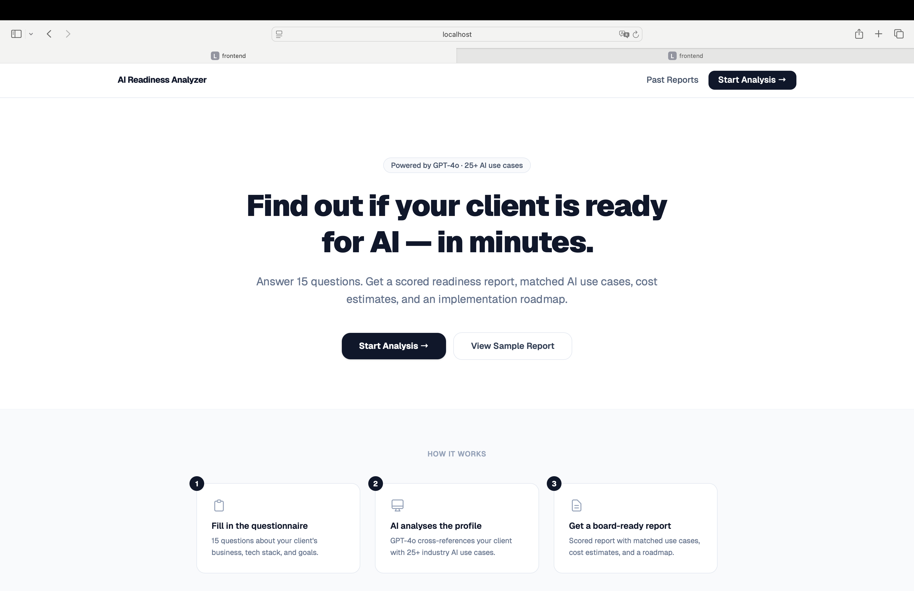
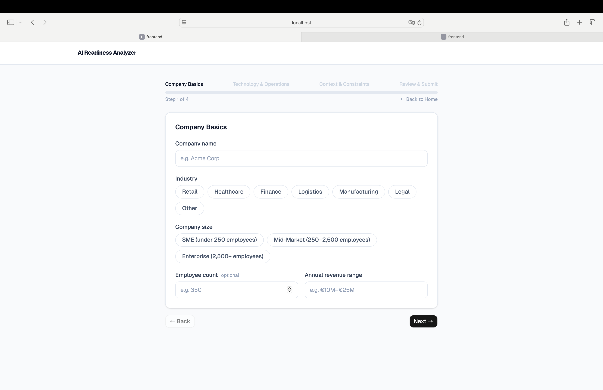
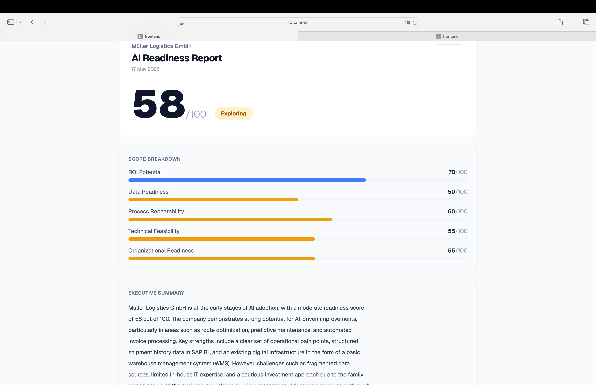
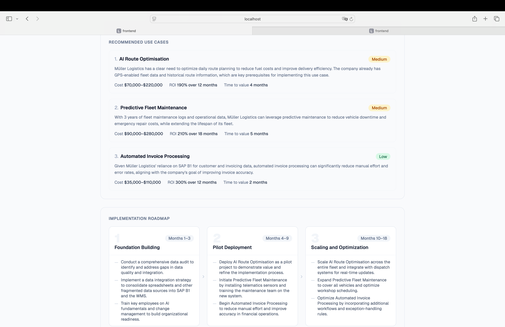

# AI Readiness Analyzer

A full-stack AI consulting tool that assesses businesses for AI readiness, matches them to proven use cases, and generates a board-ready report with cost estimates, ROI projections, and an implementation roadmap.



---

## What it does

1. Consultant fills a structured questionnaire about a client business
2. Two-stage GPT-4o analysis profiles the business and identifies gaps
3. Hybrid retrieval (structured library + semantic RAG) matches relevant AI use cases
4. Report generated with readiness score, matched use cases, cost/ROI estimates, and a 3-phase implementation roadmap

---

## Screenshots

**Multi-step questionnaire — industry chips, tag inputs, suggestion chips**


**Readiness report — score breakdown, executive summary**


**Recommended use cases and implementation roadmap**


---

## Tech Stack

### Backend
- Python + FastAPI
- Azure OpenAI (GPT-4o for analysis, text-embedding-ada-002 for embeddings)
- Supabase (PostgreSQL + pgvector for vector search)
- LangChain (document loading and chunking only)
- Two-stage LLM analysis with async background processing

### Frontend
- React + Vite
- Tailwind CSS + shadcn/ui
- React Router
- Multi-step questionnaire with tag inputs and chip selectors

### AI Architecture
- Stage 1: GPT-4o profiles the business and generates targeted RAG queries
- Layer 1 retrieval: SQL filtered use case library (structured benchmarks)
- Layer 2 retrieval: pgvector semantic search with MMR re-ranking and industry pre-filtering
- Stage 2: GPT-4o gap analysis against retrieved context
- Validation layer strips ungrounded recommendations

---

## Knowledge Base

- curated AI use cases across retail, healthcare, finance, logistics, manufacturing, and legal
- Cost and ROI benchmarks sourced from McKinsey, BCG, Stanford HAI, and PwC research (2024–2025)
- 895 RAG chunks from 9 industry research documents
- MMR (Maximal Marginal Relevance) retrieval ensures source diversity in context

---

## Project Structure

```
ai-readiness-analyzer/
├── backend/
│   ├── services/
│   │   ├── analysis_service.py    # Two-stage GPT-4o analysis
│   │   ├── retrieval_service.py   # MMR + pgvector retrieval
│   │   └── embedding_service.py   # Azure OpenAI embeddings
│   ├── routers/
│   │   ├── analyze.py             # POST /api/analyze, GET /api/reports
│   │   └── profiles.py            # POST /api/profiles
│   ├── db/
│   │   ├── migrations.sql         # Schema
│   │   └── seed.sql               # Use case library
│   ├── ingest.py                  # PDF ingestion pipeline
│   └── main.py
└── frontend/
    └── src/
        ├── components/
        │   ├── QuestionnaireForm.jsx
        │   ├── ReportView.jsx
        │   ├── PastReports.jsx
        │   ├── LandingPage.jsx
        │   └── Navbar.jsx
        └── App.jsx
```

---

## Setup

### Prerequisites
- Python 3.11+
- Node.js 18+
- Supabase account
- Azure OpenAI account with GPT-4o and text-embedding-ada-002 deployed

### Backend

```bash
cd backend
python -m venv venv
source venv/bin/activate
pip install -r requirements.txt
cp .env.example .env
# Fill in your credentials in .env
uvicorn main:app --reload --port 8000
```

### Database setup

1. Create a Supabase project
2. Enable the pgvector extension in Database → Extensions
3. Run `backend/db/migrations.sql` in the SQL Editor
4. Run `backend/db/seed.sql` in the SQL Editor
5. Disable RLS on all tables for development

### RAG corpus ingestion

```bash
cd backend
python ingest.py \
  --file data/your-report.pdf \
  --title "Report Title" \
  --source-url "https://source-url.com" \
  --industry-tags "retail,finance,healthcare"
```

### Frontend

```bash
cd frontend
npm install
cp .env.example .env
# Set VITE_API_URL=http://localhost:8000
npm run dev
```

---

## Cost & ROI Methodology

Estimates are indicative benchmarks drawn from McKinsey, BCG, Stanford HAI, and PwC industry research (2024–2025). They represent median outcomes across documented implementations and should be treated as planning ranges, not guarantees. Actual results depend on vendor selection, team capacity, and integration complexity.

---


